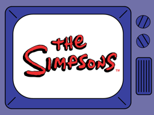

# simpsons-shorts

A desktop app to watch Simpsons shorts while your monolith app compiles. Made to learn Compose Multiplatform!

<p align="center"></p>

---

## How?

The app was developed and built with [Compose Multiplatform](https://www.jetbrains.com/lp/compose-multiplatform/), a
framework to build applications for multiple platforms, without having to rewrite the same code multiple times. It's
very similar to Flutter in terms of architecture, declarative programming model and API.

## Architecture

In terms of project structure, the application has been segregated in several different layers:

- **core**, responsible for providing the app foundations like DI and state management.
- **data**, responsible for providing ways to communicate with external services and data sources.
- **logging**, responsible for logging logic.
- **presentation**, responsible for everything UI related such as re-usable compose blocks.
- **state**, responsible for domain state management logic.

And the diagram below describes how these layers communicate with each other:

<p align="center"></p>

The shorts URLs are stored in
a [single JSON file](https://raw.githubusercontent.com/freitzzz/cinderela/master/small-databases/simpson-shorts.json)
that is hosted on GitHub, so they can be queried freely and in a fast manner.

To play the short, [VLC media player](https://www.videolan.org/) is required to exist at runtime. I couldn't find a
better way to do this, and the compose block for the video player was adapted
from [Kotlin Multiplatform desktop example](https://github.com/JetBrains/compose-multiplatform/blob/master/experimental/components/VideoPlayer/library/src/desktopMain/kotlin/org/jetbrains/compose/videoplayer/DesktopVideoPlayer.kt).

### Endpoints

If you are building the app from source, you can try different endpoints for fetching the shorts URLs using `Cinderela`
networking client:

- `/small-databases/simpson-shorts.json` will fetch URLs of shorts hosted on YouTube.
- `/small-databases/simpsons-shorts-hub.json` will fetch URLs of shorts hosted
  on [GitHub](https://github.com/mentalillnessisveryimportant/videos/tree/main/simpsons/asd/simpsons). These shorts will
  play faster.

### What is a Reactor?

Reactor is an event stream like reaction engine that propagates **events** into 0 or more **states** (1 Event > *
State). It's used to operate as middleman between UI and domain logic, being states new UI updates. The provided API is
pretty straight forwarded:

First, you will need to implement a Reactor for your domain use case (in the case of the app,
a reactor for playing shorts).

```kotlin
class AuthReactor : Reactor<AuthEvent, AuthState>(NotAuthenticated())
```

Secondly, you will need to think about events and states. Events are **actions** you want to take in your use case (Next
short) and states are **updates** originated from these events (fetched shorts urls).

```kotlin
interface AuthEvent
data class AuthenticationStarted(val credentials: Credentials) : AuthEvent
...

interface AuthState
class AuthenticationInProgress : AuthState
class AuthenticationSuccessful : AuthState
class AuthenticationFailure : AuthState
```

Having defined your API, you can start implementing the _event to state_ logic for your domain use cases. For this, you
will need to call the `on<Event>` API inside the `init` block:

```kotlin
init {
    on<AuthenticationStarted> {
    val credentials = Credentials(it.username, it.password)
    val authenticated = AuthenticationService.login(credentials)

    if (authenticated) {
        emit(AuthenticationSuccessful())
    } else {
        emit(AuthenticationFailure())
    }
}
```

Finally, when users take actions in the app, dispatch events in the reactor using `add` method. If all goes well, you
can subscribe to the state using the `subscribe` compose call:

```kotlin
val reactor = AuthReactor()
reactor.add(AuthenticationStarted())

val state by reactor.subscribe()
```

Note: if you have used Flutter before, Reactor is basically the same as a [`Bloc`](https://bloclibrary.dev/). Many
thanks to the bloc team and [@ptrbrynt](https://github.com/ptrbrynt/KotlinBloc) for the inspiration.

### Dependencies

The application attempts to be bloat free and use as many available APIs as possible. For HTTP requests,
a [wrapper](src/main/kotlin/data/clients/NetworkingClient.kt)
around Java `URL` was created to replace fat dependencies such as `RetroFit`.

For JSON parsing I didn't want to
implement a small and error-prone parser, so decided to stick with `kotlinx-serialization-json` (without intermediate
classes
generation) instead.

For logging, I'm using my own library (`lumberkodee`) that provides a customizable and friendly API for logging anywhere
in
the app with top-level calls.

The fatter dependency is for interoping with VLC: `uk.co.caprica:vlcj`.

## Requirements

To run the app, you will need to have **VLC** installed on your machine (this applies to both Windows and Linux/macOS).
To build the app, you will need a **JDK** >= 15 (alternatively you can use a JDK >= 11 to run the app via IDE, but you
can't distribute/ship it). I built the app using
version [`17.0.7-amzn` (Amazon Corretto)](https://docs.aws.amazon.com/corretto/latest/corretto-17-ug/downloads-list.html).

## Building and Distribution

To build the app for local installation: `./gradlew createDistributable`

To distribute the app: `./gradlew packageDistributionForCurrentOS`

To simply run the app: `./gradlew run`

## Demo

https://github.com/freitzzz/simpsons-shorts/assets/26190214/9a14c1e2-f887-4340-89f6-82b24769a13d
